# IKEA VINDSTYRKA Teardown

Let's start with an overall look here and comparison to its predecessor VINDRIKTNING.

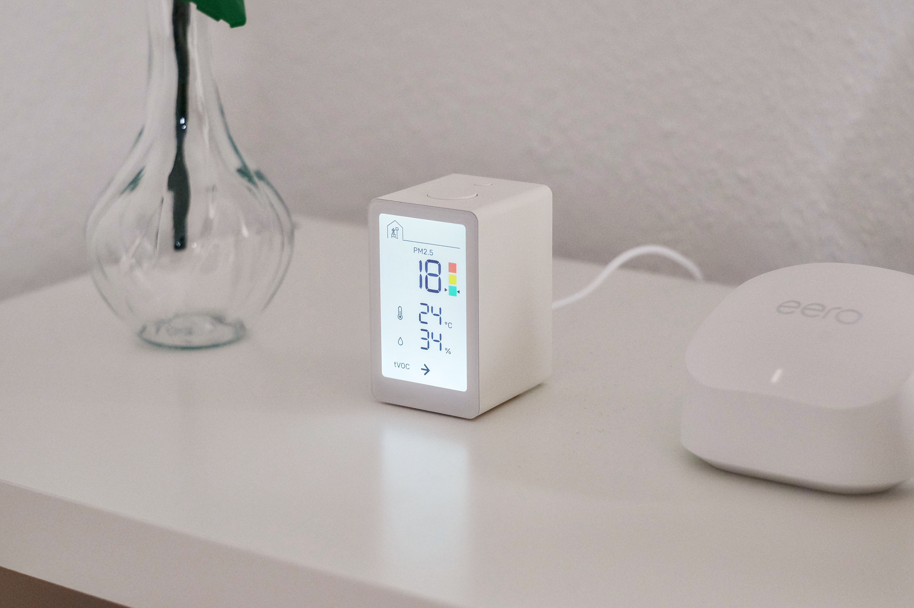

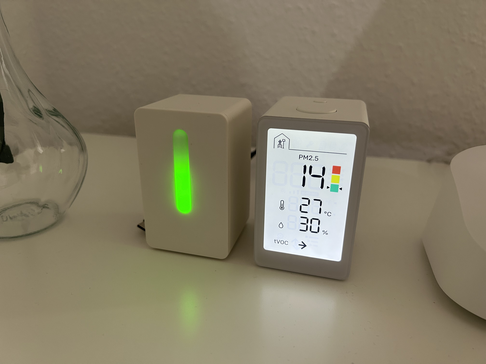

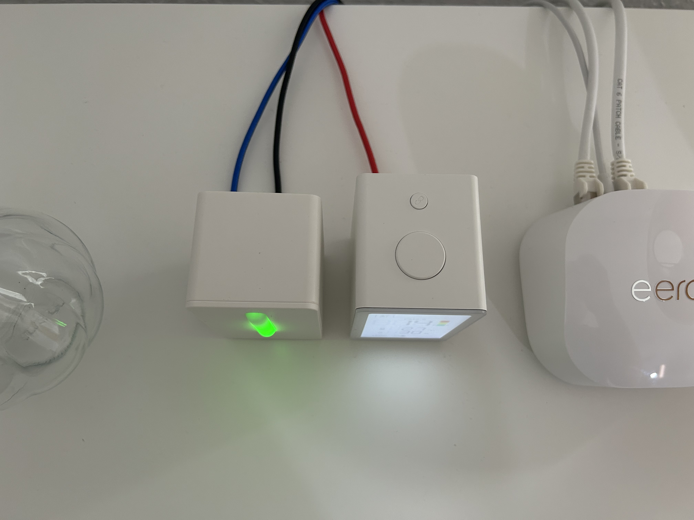

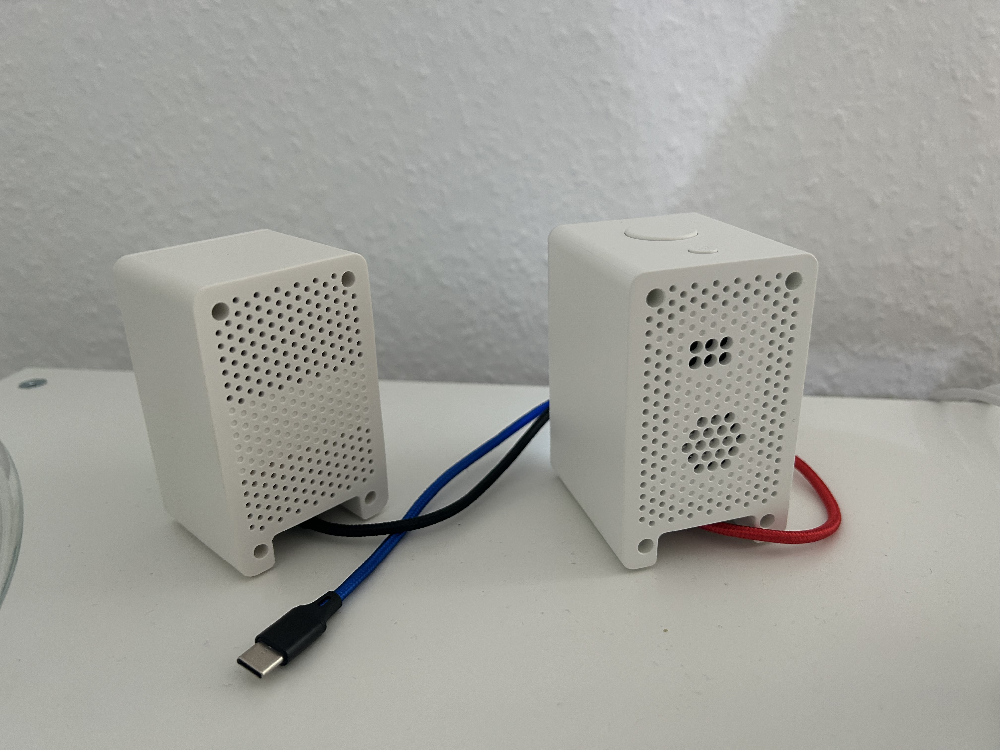

This device is definitely an improvement compared to the previous one. IKEA engineers seem to have considered the previous generation when developing this one. Starting with making it a bit harder for us to disassemble and use three different screw types. You will need a long **Torx T6** for outer screws, **Philips 2.0** for the inner frame and **Philips 1.5** for PCB screws. The display cover is held in place with only sticky tape, so be careful prying it.

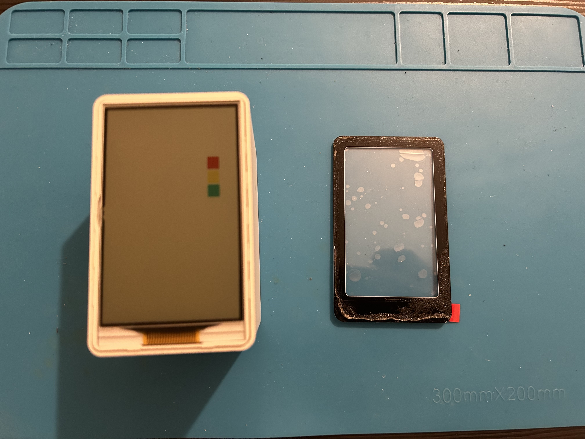

The outer screws are holding the frame where the display is mounted. You can again see two connectors: to the sensor and the second PCB with buttons on top.

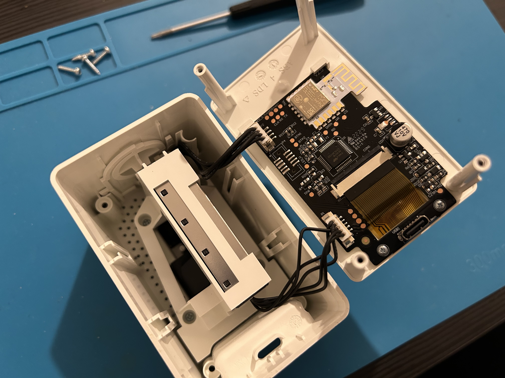

The sensor has its frame and is held with screws. This time it has a gasket to keep it exactly against the corresponding openings on the backside.

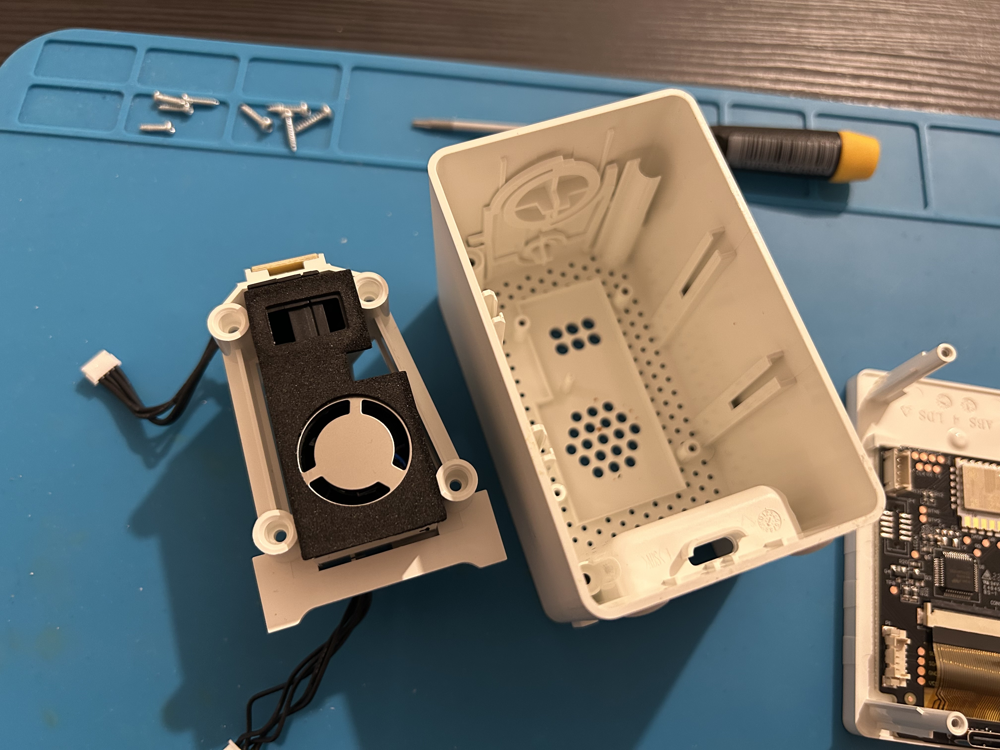

The sensor is [SEN54 from Sensirion](https://sensirion.com/products/catalog/SEN54/)

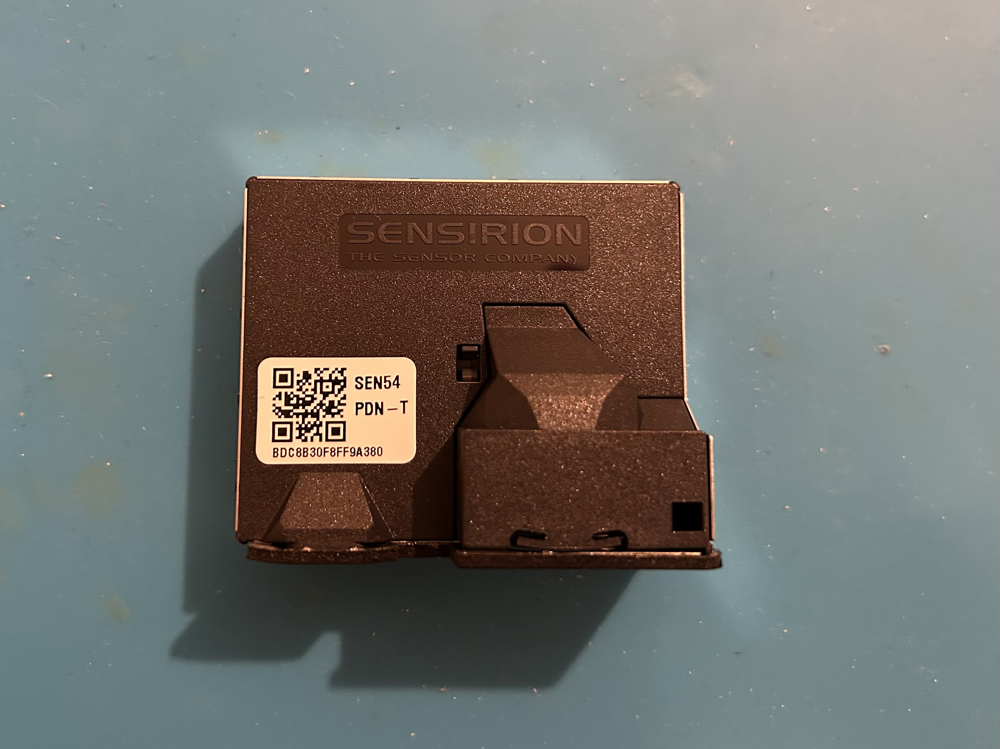

Additional PCB with buttons on top of the sensor frame. A lot of marked test points make me happy 🙂

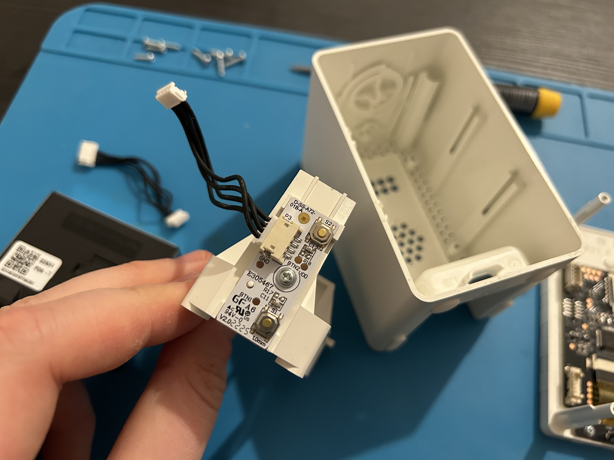

The main PCB with VINKA [VK15218B](IMG_5576.jpeg) MCU and [MGM210L022JNF2](https://www.silabs.com/wireless/zigbee/efr32mg21-series-2-modules) radio module from Silicon Labs. Supports both Zigbee and Thread, is Matter compatible but feels like it's unlikely that it will get a Matter over Thread upgrade anytime soon.

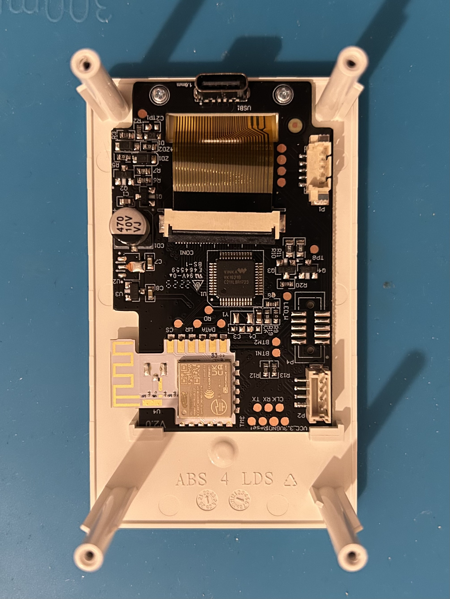

Yeah, the test points. We've got enough of them 😄

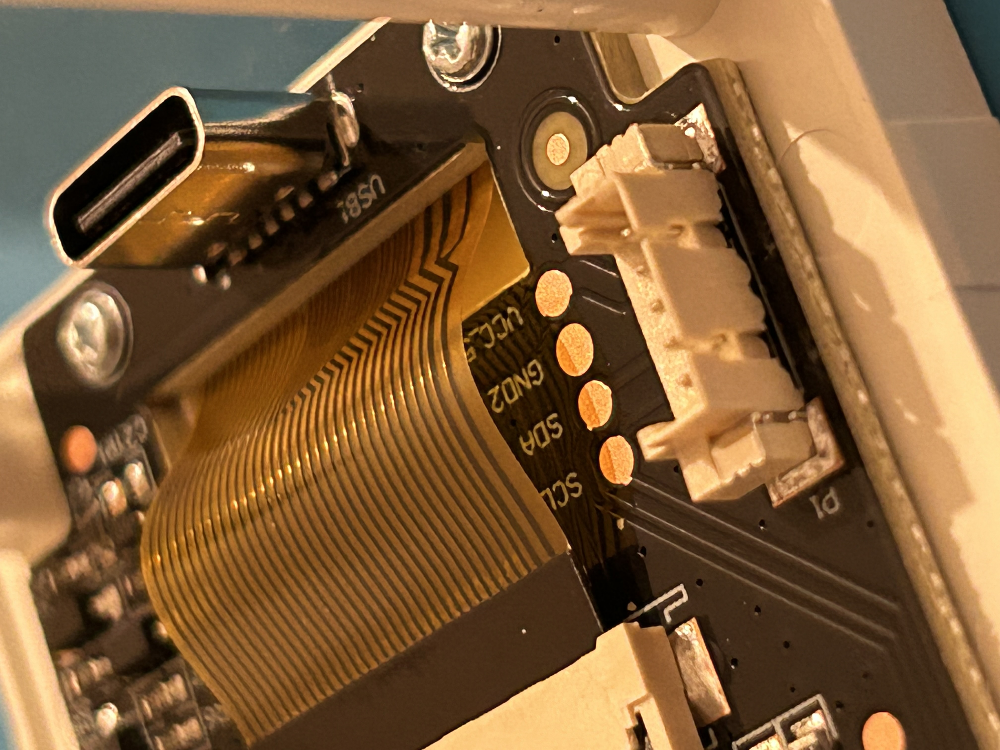

